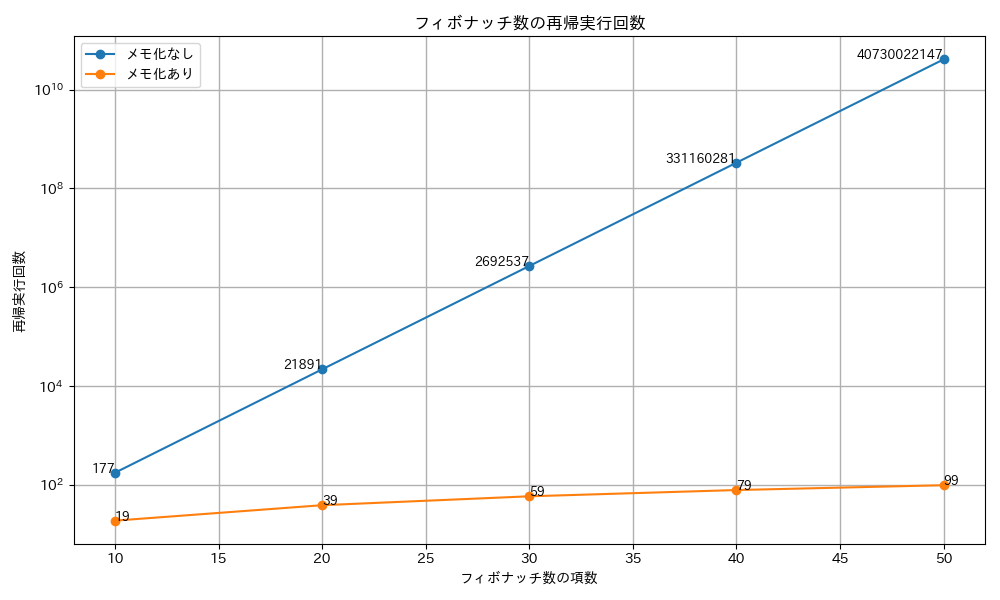
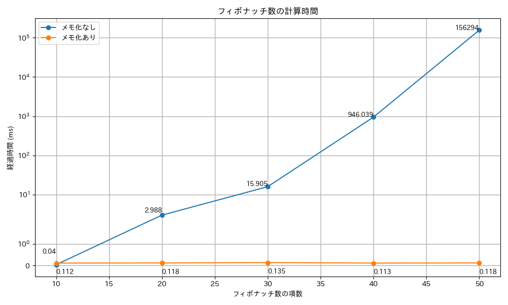

# フィボナッチ数列の計算

メモ化を使用した場合と使用していない場合では、計算のフローにおける「**重複計算の有無**」が主な違いです。

メモ化をしている場合、計算済みの結果を保存し、再利用することで**同じ計算を繰り返さない**ようにします。
これにより、各フィボナッチ数が1回しか計算されず、計算量は大幅に削減されます。

一方、メモ化をしていない場合、**同じ計算が何度も繰り返される**ため、指数関数的に計算量が増え、効率が非常に悪くなります。
とくに大きな数を求めるときに顕著な差が生じます。

## フローの違い：`fibonacci(5)`を例に説明

### メモ化なしの計算フロー

以下のように、同じ計算（`fibonacci(2)`や`fibonacci(3)`）が何度も呼び出されています。

```txt
fibonacci(5)
  -> fibonacci(4) + fibonacci(3)
    -> (fibonacci(3) + fibonacci(2)) + (fibonacci(2) + fibonacci(1))
      -> ((fibonacci(2) + fibonacci(1)) + (fibonacci(1) + fibonacci(0))) + ((fibonacci(1) + fibonacci(0)) + 1)
        -> (((1 + 0) + 1) + (1 + 0)) + ((1 + 0) + 1)
```

- `fibonacci(3)`や`fibonacci(2)`が複数回計算されています。
- 全体として、**同じ値が計算されるたびに新しい再帰呼び出しが発生**し、膨大な計算量になります。

### メモ化ありの計算フロー

メモ化を使うと、初回の計算結果を`memo`に保存するため、計算済みの値が再利用され、再帰呼び出しが削減されます。

```txt
fibonacci(5)
  -> fibonacci(4) + fibonacci(3)
    -> (fibonacci(3) + fibonacci(2)) + memo[3] (再利用)
      -> (memo[2] + memo[1]) + memo[3]
        -> 結果を返す
```

- `fibonacci(3)`や`fibonacci(2)`の計算結果がメモに保存され、再利用されます。
- 重複計算が削減され、**各フィボナッチ数が一度だけ計算されます**。

## 計算量の違い

- **メモ化なし**: 計算量は`O(2^n)`で、指数関数的に増加します。
- **メモ化あり**: 計算量は`O(n)`で、線形に増加します。

したがって、50番目のフィボナッチ数の計算では、メモ化をしていると数100回程度の計算で済みますが、メモ化がない場合は数兆回以上の計算が発生する可能性があります。
この違いが処理速度に大きな影響を与えます。

| 項数 | メモ化なし  | メモ化あり |
| ---- | ----------- | ---------- |
| 10   | 177         | 19         |
| 20   | 21891       | 39         |
| 30   | 2692537     | 59         |
| 40   | 331160281   | 79         |
| 50   | 40730022147 | 99         |



## 実行速度の比較

| 項数 | メモ化なし | メモ化あり |
| ---- | ---------- | ---------- |
| 10   | 0.04ms     | 0.112ms    |
| 20   | 2.988ms    | 0.118ms    |
| 30   | 15.905ms   | 0.135ms    |
| 40   | 946.039ms  | 0.113ms    |
| 50   | 156294ms   | 0.118ms    |


